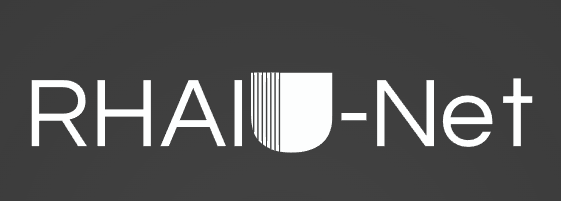
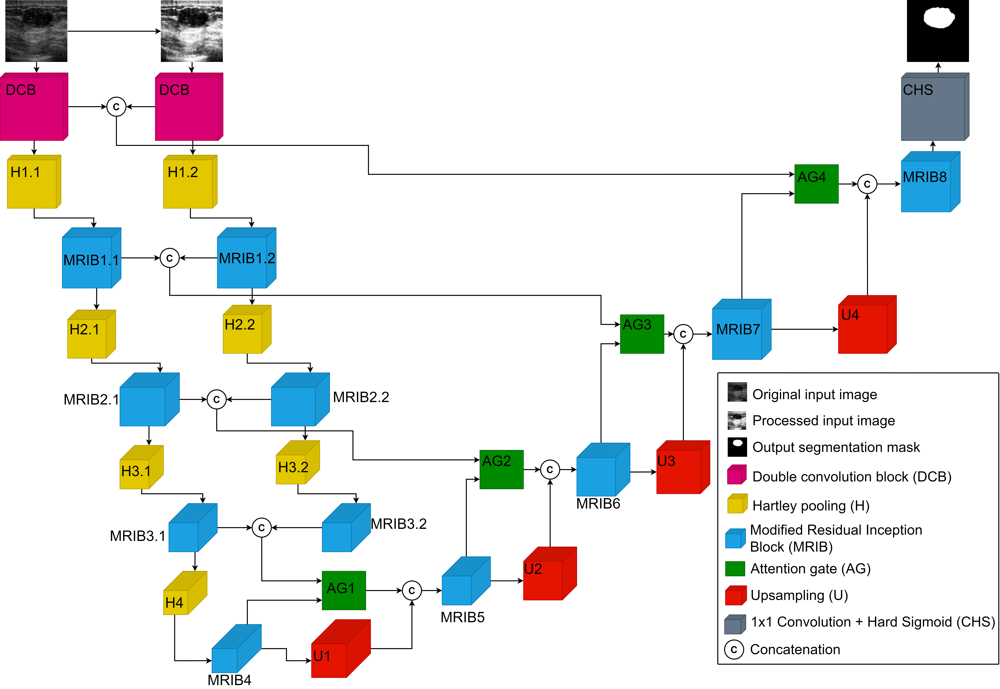
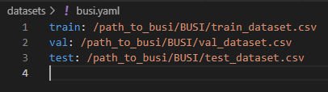
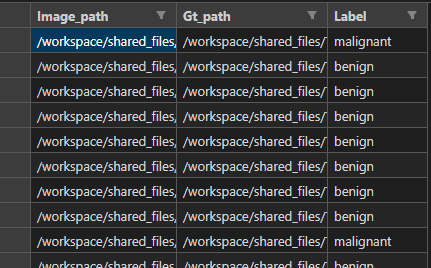
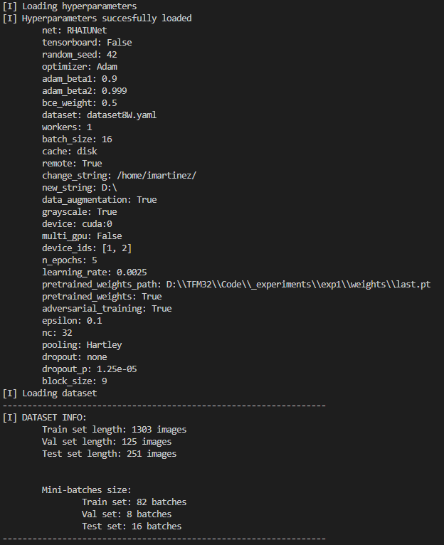
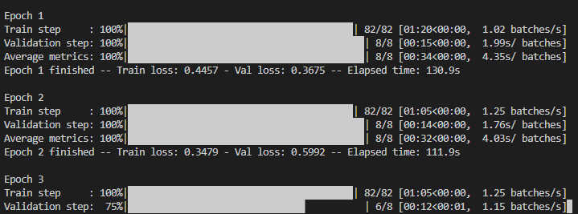
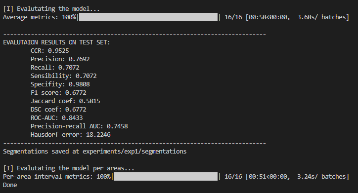

<p align="center">
  <a href="" rel="noopener">
 </a>
</p>

<h3 align="center">RHAIU-NET: Precise Tumor segmentation on Breast Ultrasound Images</h3>

<div align="center">

[]()
[](/LICENSE)

</div>

---

<p align="center"> RHAUI-Net Implementation, an architecture based on RDAU-Net for breast ultrasound segmentation.
    <br> 
</p>

<p align="center">
 </a>
</p>


## 📝 Table of Contents

- [About](#about)
- [Getting Started](#getting_started)
- [Training models](#training)
- [Usage](#usage)
- [Built Using](#built_using)
- [TODO](../TODO.md)
- [Contributing](../CONTRIBUTING.md)
- [Authors](#authors)
- [Acknowledgments](#acknowledgement)

## 🧐 About <a name = "about"></a>

In this work, we propose RHAIU-Net, a CNN-based novel architecture for breast ultrasound image segmentation. Specifically, it is based on the U-Net architecture, incorporating residual inception blocks, SiLU activation functions, attention gates, and Hartley pooling layers. We also propose a training framework which consists of data augmentation, image prepossessing, learning rate decay, and adversarial training.

Original work: [RHAIU-Net: Precise Tumor segmentation on Breast Ultrasound Images](https://doi) - Journal

## 🏁 Getting Started <a name = "getting_started"></a>

These instructions detail how to create an environment in which to run the project.

### Installing

Clone the repository

```cmd
git clone https://github.com/im-garriz/rhaiunet.git
```

Install requerimenst in a new enviroment

```cmd
conda create --name rhaiunet
conda activate rhaiunet
pip install -r requirements.txt
```

End with an example of getting some data out of the system or using it for a little demo.

### Segmentation examples

- Green: ground truth
- Red: Model segmentation
- Yellow: intersection

<h4>Benign tumors</h4>

</a>
</a>


<h4>Malignant tumors</h4>

</a>
</a>

<h4>Small tumors</h4>

</a>
</a>

## 🎈 Usage <a name="usage"></a>

### Hyperparameters and configuration

Both the hyperparameters settings and the general training settings are configured in [hyperparameters.yaml](./hyperparameters/hyperparameters.yaml).

### Dataset

The following requirements are necessary to use a dataset:

 - a yaml file inside the datasets folder containing the train, val, and test fields. Each of them will contain the path to a csv file containing the images belonging to each of the sets. The program will be told which one to use in "hyperparameters.yaml" ("dataset" field).

</a>

- The headers of the csv files must be: "image_path", "gt_path" and "label". Both image_path and gt_path will contain the absolute path to each of the images/masks. label will contain "benign", "malignant" or "normal", depending on the type of image.

</a>

As the csv files might be generated on one computer, but then the code is executed on another computer (or in the cloud), inside "hyperparameters.yaml" some fields have been enabled to avoid having to modify all the csv files line by line. If the "remote" field is set to True, the "change_string" field will be replaced with "new_string" in all the paths when reading the images. So, being "remote" True, and being "change_string"="original_path" and "new_string"="new_path", when reading the images from the disk instead of trying to read /original_path/image.png, it will read /new_path/image.png. In this way, to work in several computers, it will only be necessary to change the respective yaml file with the paths to the csvs and the 3 mentioned fields.

## 🚀 Training models <a name = "training"></a>

To start the training of a model

```
python train.py
```

First, it outputs info about hyperparameter configuration and data

</a>

It shows interactive progress bars for each epoch

</a>

When finised, both average and per interval metric are calculated

</a>


Each execution creates a folder inside the experiments directory: exp1, exp2, etc.
Each one contains:

- segmentations folder: where segmentations and metrics of the last model are saved
- weights folder: where last and best models weights are saved
- log.txt
- metrics.csv: file with the value of all metrics on each epoch


## ⛏️ Built Using <a name = "built_using"></a>

- [PyTorch](https://pytorch.org/) - Deep Learning Framework
- [imgaug](https://github.com/aleju/imgaug) - Data augmentation Framework
- [OpenCV](https://opencv.org/) - Image processing
- [Pillow](https://github.com/python-pillow/Pillow) - Image processing

## ✍️ Authors <a name = "authors"></a>

- [Iñaki M. Gárriz](https://github.com/im-garriz) - Thesis author and developer
- [F. Javier Díez](https://www.uned.es/universidad/docentes/informatica/francisco-javier-diez-vegas.html), [Jorge Pérez](https://www.uned.es/universidad/docentes/informatica/jorge-perez-martin.html), [Mariano Rincón](https://portalcientifico.uned.es/investigadores/183036/publicaciones) - Thesis supervisors

## 🎉 Acknowledgements <a name = "acknowledgement"></a>

- Datasets 
- Hat tip to anyone whose code was used
- Inspiration
- References
